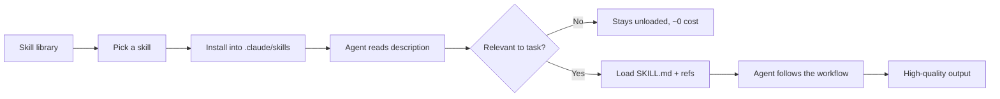

<div align="center">

# 🛠️ AgentSkills

**The largest community-driven library of Agent Skills for Claude, Codex, Gemini CLI, Cursor & friends.**

Plug-and-play `SKILL.md` packages — instructions, references, scripts, and examples — that teach AI agents to do real work, from code review to career coaching.

[](#-skill-catalog)
[](#-skill-catalog)
[](https://github.com/JayRHa/AgentSkills/stargazers)
[](./LICENSE)

<p>
  <a href="https://jannikreinhard.com/">Blog</a> ·
  <a href="https://www.linkedin.com/in/jannik-r/">LinkedIn</a> ·
  <a href="https://x.com/jannik_reinhard">X</a>
</p>

`72 Skills` · `10 Categories` · `455+ Files` · `Open Standard` · `Community Maintained`

</div>

## What is this?

This repository is a growing, **production-ready** library of [Agent Skills](https://agentskills.io). Each skill is a self-contained folder with a `SKILL.md` (instructions + when to use it) plus supporting **references, runnable scripts, examples, and templates**. Compatible agents — Claude Code, the Claude apps, Codex, Gemini CLI, Cursor and more — automatically discover a skill from its description and load the full body only when it's relevant, so skills are cheap until used.

> Each skill is a folder right here in the repo root. Browse the [catalog](#-skill-catalog) below — from code review and Terraform to threat modeling, interview prep, budgeting, and trip planning.

---

## How It Works



---

## Quick Start

### Install a skill into Claude Code
```bash
git clone https://github.com/JayRHa/AgentSkills.git
cd AgentSkills

# install specific skills (personal scope: ~/.claude/skills)
./scripts/install-skill.sh code-reviewer terraform-module-author

# or install everything
./scripts/install-skill.sh --all

# or into the current project (./.claude/skills)
./scripts/install-skill.sh --project code-reviewer
```

Then restart your agent. Ask something that matches a skill's description, or invoke it directly with `/code-reviewer`.

You can also just copy any skill folder into your own `.claude/skills/` directory.

---

## 📚 Skill Catalog

### 🧑‍💻 Engineering (12)

| Skill | What it does |
| --- | --- |
| [`code-reviewer`](./code-reviewer) | Reviews a code diff or pull request for correctness bugs, security vulnerabilities, and quality/maintainability problems, producing severity-ranked findings with file/line references and concrete fix suggestions. |
| [`unit-test-author`](./unit-test-author) | Writes thorough, maintainable unit tests with comprehensive edge cases, table-driven cases, proper mocking/stubbing, and meaningful coverage across languages and frameworks (pytest, Jest/Vitest, Go testing, JUnit, RSpec, xUnit, Rust). |
| [`refactoring-guide`](./refactoring-guide) | Applies safe, incremental, behavior-preserving refactorings (extract function/variable, rename, inline, decompose conditionals, remove duplication, replace conditional with polymorphism, introduce parameter object) using a test-protected, small-step workflow. |
| [`debug-detective`](./debug-detective) | Systematically root-causes software bugs using a reproduce → isolate → hypothesize → bisect → verify methodology, replacing guess-and-check debugging with a disciplined, evidence-driven investigation. |
| [`api-designer`](./api-designer) | Designs clean, consistent REST and GraphQL APIs covering resource modeling, URL structure, versioning, pagination, filtering, error formats (RFC 9457 Problem Details), idempotency, authentication, rate limiting, and machine-readable contracts (OpenAPI 3.1 / GraphQL SDL). |
| [`regex-architect`](./regex-architect) | Designs, explains, hardens, and tests regular expressions for parsing and validation tasks (emails, URLs, dates, IPs, log lines, CSV fields, identifiers, etc.) while actively defending against catastrophic backtracking (ReDoS). |
| [`sql-optimizer`](./sql-optimizer) | Diagnoses and fixes slow SQL queries using EXPLAIN/EXPLAIN ANALYZE plan reading, index design, query rewrites, statistics, and schema-aware tuning across PostgreSQL, MySQL/MariaDB, SQL Server, Oracle, and SQLite. |
| [`dockerfile-pro`](./dockerfile-pro) | Authors small, secure, reproducible multi-stage Dockerfiles with build-cache optimization, pinned base images, non-root runtime users, and minimal attack surface. |
| [`git-workflow`](./git-workflow) | Guides safe, professional Git usage — branching strategies, atomic clean commits, conventional commit messages, interactive rebase (squash/fixup/reword/reorder), merge vs rebase decisions, conflict resolution, and recovery of lost work via reflog. |
| [`dependency-upgrader`](./dependency-upgrader) | Safely upgrades project dependencies by inventorying outdated packages, reading changelogs and migration guides, staging upgrades in isolated commits, running tests at each step, and rolling back cleanly on failure. |
| [`performance-profiler`](./performance-profiler) | Systematically finds and fixes performance bottlenecks by measuring first, profiling hot paths, reducing algorithmic and I/O cost, and verifying gains with before/after benchmarks. |
| [`error-handling-patterns`](./error-handling-patterns) | Designs robust, production-grade error handling — choosing between result types and exceptions, implementing retries with exponential backoff and jitter, applying timeouts and deadlines, adding circuit breakers, and building graceful degradation and fallbacks. |

### ☁️ DevOps & Cloud (10)

| Skill | What it does |
| --- | --- |
| [`github-actions-builder`](./github-actions-builder) | Builds reliable, fast, and secure GitHub Actions CI/CD workflows with dependency caching, build matrices, scoped secrets, concurrency control, and reusable/composite workflows. |
| [`terraform-module-author`](./terraform-module-author) | Authors reusable, production-grade Terraform modules with clean typed variables, well-documented outputs, version pinning, state hygiene, and built-in validation. |
| [`kubernetes-manifest-author`](./kubernetes-manifest-author) | Authors production-grade Kubernetes manifests — Deployments, Services, Ingress, probes, resource requests/limits, security contexts, and ConfigMaps/Secrets wiring — following hardening and reliability best practices. |
| [`nginx-config-pro`](./nginx-config-pro) | Generates and hardens production nginx configurations for reverse proxying with TLS termination, HTTP/2, response caching, rate limiting, gzip/brotli compression, and security headers. |
| [`incident-postmortem`](./incident-postmortem) | Facilitates blameless incident postmortems by reconstructing a precise timeline, identifying root cause and contributing factors, and producing tracked, owned action items. |
| [`observability-setup`](./observability-setup) | Instruments applications with structured logging, metrics, and distributed traces, then derives SLIs, SLOs, error budgets, and alerts that page only on user-facing pain. |
| [`secrets-manager`](./secrets-manager) | Detects, prevents, and remediates leaked credentials and teaches safe secret handling using environment variables, vaults (HashiCorp Vault, AWS/GCP/Azure secret stores), KMS envelope encryption, and rotation. |
| [`bash-script-hardening`](./bash-script-hardening) | Writes robust, safe, shellcheck-clean Bash scripts using strict mode, defensive quoting, error traps, safe temp files, and signal handling. |
| [`cron-scheduler`](./cron-scheduler) | Builds, validates, explains, and previews cron expressions across Vixie/POSIX cron, systemd timers, and cloud schedulers, with explicit handling of timezones, DST, the day-of-month/day-of-week OR-logic trap, and overlap/missed-run pitfalls. |
| [`aws-cost-optimizer`](./aws-cost-optimizer) | Systematically reduces AWS cloud spend by right-sizing over-provisioned compute, finding and eliminating idle or orphaned resources, committing to Savings Plans and Reserved Instances, and enforcing cost-allocation tagging. |

### 📊 Data & ML (8)

| Skill | What it does |
| --- | --- |
| [`pandas-data-cleaning`](./pandas-data-cleaning) | Cleans messy tabular datasets in pandas end-to-end — fixing dtypes, parsing dates and numbers, standardizing text, handling missing values, removing duplicates, detecting and treating outliers, and reshaping wide/long into tidy data. |
| [`sql-schema-designer`](./sql-schema-designer) | Designs normalized relational database schemas with primary/foreign keys, constraints, indexes, and deliberate denormalization, producing engine-aware DDL and an ER model. |
| [`data-pipeline-architect`](./data-pipeline-architect) | Designs robust ETL/ELT data pipelines covering ingestion, idempotency, schema evolution, orchestration, and data quality validation. |
| [`chart-chooser`](./chart-chooser) | Selects the most appropriate chart type for a given dataset and analytical question, then produces a clean, honest, well-labeled visualization spec. |
| [`json-schema-author`](./json-schema-author) | Authors and validates JSON Schema (Draft 2020-12 and Draft-07) for configuration files and HTTP/REST APIs, applying types, constraints, composition keywords, and human-readable error messaging. |
| [`ab-test-analyzer`](./ab-test-analyzer) | Designs and analyzes A/B tests end-to-end — frames a sharp hypothesis, computes required sample size and test duration, runs significance tests (two-proportion z-test, Welch's t-test, chi-square), reports confidence intervals and lift, and flags common pitfalls like peeking, multiple comparisons, and Simpson's paradox. |
| [`prompt-engineer`](./prompt-engineer) | Designs, refines, and systematically evaluates LLM prompts using structure, role framing, few-shot examples, explicit output contracts, and reasoning scaffolds. |
| [`rag-pipeline-designer`](./rag-pipeline-designer) | Designs end-to-end retrieval-augmented generation (RAG) systems by making principled choices for chunking, embeddings, vector indexing, retrieval, reranking, prompt assembly, and offline evaluation. |

### ✍️ Writing & Communication (12)

| Skill | What it does |
| --- | --- |
| [`technical-writer`](./technical-writer) | Produces clear, well-structured technical documentation — guides, API docs, READMEs, tutorials, reference pages, and release notes — by analyzing audience, choosing the right document type, applying plain-language and information-architecture principles, and including runnable examples. |
| [`readme-generator`](./readme-generator) | Generates polished, well-structured project READMEs with badges, a one-line tagline, quick-start, installation, usage examples, configuration tables, contribution guidelines, and a license section. |
| [`changelog-keeper`](./changelog-keeper) | Maintains a CHANGELOG.md in the Keep a Changelog format with Semantic Versioning, grouping user-facing entries under Added/Changed/Deprecated/Removed/Fixed/Security and cutting dated releases from an Unreleased section. |
| [`blog-post-writer`](./blog-post-writer) | Writes engaging technical blog posts with a strong hook, clear structure, concrete examples, and a memorable takeaway. |
| [`release-notes-writer`](./release-notes-writer) | Transforms merged pull requests, commit logs, and changelog entries into clear, user-facing release notes grouped into Features, Improvements, Bug Fixes, and Breaking Changes. |
| [`adr-author`](./adr-author) | Authors Architecture Decision Records (ADRs) that capture context, considered options with trade-offs, the chosen decision, and its consequences. |
| [`email-composer`](./email-composer) | Drafts clear, professional emails with the right tone, structure, and a concrete call to action by clarifying audience, purpose, and desired outcome. |
| [`meeting-summarizer`](./meeting-summarizer) | Transforms raw meeting notes, transcripts, or recordings text into a concise, scannable summary with clear sections for decisions made and owned action items (owner + due date). |
| [`proofreader`](./proofreader) | Edits prose for grammar, spelling, punctuation, clarity, concision, and consistent style while preserving the author's meaning, voice, and intent. |
| [`api-docs-writer`](./api-docs-writer) | Writes precise, complete reference documentation for HTTP/REST APIs and authors valid OpenAPI 3.1 specifications, including endpoint pages, request/response schemas, parameter tables, authentication, pagination, code samples, and error tables. |
| [`public-speaking-coach`](./public-speaking-coach) | Coaches a speaker to prepare and deliver a talk, presentation, toast, or pitch — shaping a core message and narrative arc, structuring the talk, writing a strong open and close, tightening delivery, and managing nerves and Q&A. |
| [`mermaid-diagram-builder`](./mermaid-diagram-builder) | Creates clear, valid, version-controllable diagrams as code using Mermaid — flowcharts, sequence diagrams, ER diagrams, class diagrams, state machines, Gantt charts, C4/architecture diagrams, and more. |

### 📈 Productivity & Business (8)

| Skill | What it does |
| --- | --- |
| [`okr-writer`](./okr-writer) | Writes strong OKRs (Objectives and Key Results) with outcome-focused, inspiring objectives and measurable, ambitious, time-bound key results. |
| [`swot-analyzer`](./swot-analyzer) | Produces a rigorous SWOT analysis (Strengths, Weaknesses, Opportunities, Threats) for a company, product, team, project, or personal decision, then converts the four quadrants into prioritized, concrete strategic actions using a TOWS cross-matrix. |
| [`project-planner`](./project-planner) | Decomposes a goal into a work breakdown structure (WBS) with milestones, task dependencies, and effort estimates, then produces a schedule, critical path, and risk list. |
| [`decision-matrix`](./decision-matrix) | Builds a weighted decision matrix to compare options against criteria with transparent, reproducible scoring and sensitivity analysis. |
| [`presentation-builder`](./presentation-builder) | Outlines compelling presentations built around a single core message, a clear narrative arc, one idea per slide, and concrete speaker notes. |
| [`user-story-writer`](./user-story-writer) | Writes high-quality agile user stories that satisfy the INVEST criteria, with clear role/goal/benefit phrasing and testable Gherkin (Given/When/Then) acceptance criteria, and splits epics into thin vertical slices. |
| [`competitive-analysis`](./competitive-analysis) | Analyzes competitors and market position through structured data collection, feature/pricing comparison matrices, SWOT, positioning maps, and actionable strategic recommendations. |
| [`job-description-writer`](./job-description-writer) | Writes inclusive, accurate, and compelling job descriptions with a clear role summary, outcome-oriented responsibilities, must-have vs. nice-to-have requirements, impact framing, and compensation/logistics. |

### 🔒 Security (6)

| Skill | What it does |
| --- | --- |
| [`threat-modeler`](./threat-modeler) | Runs structured STRIDE threat modeling by decomposing a system into a data flow diagram, enumerating threats per element (Spoofing, Tampering, Repudiation, Information disclosure, Denial of service, Elevation of privilege), and producing prioritized, actionable mitigations with risk ratings. |
| [`security-auditor`](./security-auditor) | Audits source code against the OWASP Top 10 (2021) and produces concrete, exploitable findings with proof-of-concept, severity ratings, and copy-pasteable fixes. |
| [`secure-password-policy`](./secure-password-policy) | Defines modern authentication and password policies aligned with NIST SP 800-63B, covering minimum length, blocklist/breach screening, rate limiting, MFA, password storage hashing, and account recovery. |
| [`gdpr-data-mapper`](./gdpr-data-mapper) | Maps how personal data flows through a system and produces GDPR artifacts — a Record of Processing Activities (RoPA), lawful-basis analysis, retention schedule, and data-subject-rights readiness — for each processing activity. |
| [`vulnerability-triage`](./vulnerability-triage) | Triages and prioritizes security vulnerabilities (CVEs) by combining CVSS base/temporal scores, real-world exploitability (EPSS, KEV, public PoCs), environmental exposure (internet-facing, network reachability, authentication), and business impact (data sensitivity, asset criticality) into a defensible, ranked remediation plan with SLAs. |
| [`secure-code-review`](./secure-code-review) | Performs a security-focused review of code or a diff, hunting for injection, broken authentication/authorization, insecure crypto, hardcoded secrets, unsafe deserialization, SSRF, path traversal, and missing input validation, with exploit scenarios and concrete fixes ranked by severity. |

### 💼 Career & Job Search (4)

| Skill | What it does |
| --- | --- |
| [`resume-writer`](./resume-writer) | Writes and rewrites high-impact resumes and CVs that pass ATS screening and win recruiter attention — translating raw work history into quantified, outcome-driven bullet points, choosing the right format, and tailoring to a target role. |
| [`cover-letter-writer`](./cover-letter-writer) | Writes tailored, persuasive cover letters that connect a candidate's concrete achievements to a specific role and company — with a strong hook, evidence-backed body, and clear close. |
| [`interview-prep`](./interview-prep) | Prepares a candidate for a specific job interview — generating likely questions, coaching STAR-method stories, drilling behavioral and role-specific answers, and producing smart questions to ask back. |
| [`salary-negotiator`](./salary-negotiator) | Coaches a candidate or employee through compensation negotiation — researching market ranges, anchoring, countering an offer, negotiating the full package (base, bonus, equity, signing, benefits), and scripting the conversation. |

### 🎓 Learning (5)

| Skill | What it does |
| --- | --- |
| [`concept-explainer`](./concept-explainer) | Explains complex or technical concepts clearly at the right level for the audience, using layered depth, concrete analogies, worked examples, and checks for understanding — adapting from ELI5 to expert. |
| [`flashcard-generator`](./flashcard-generator) | Turns notes, articles, or a topic into high-quality spaced-repetition flashcards that follow proven formulation principles — atomic, minimum-information, cloze deletions, and active recall — ready to import into Anki or any SRS. |
| [`study-plan-builder`](./study-plan-builder) | Builds a realistic, personalized learning roadmap for a skill or subject — with milestones, curated resource types, active practice, spaced review, and progress checkpoints — fit to the learner's deadline and weekly time budget. |
| [`language-tutor`](./language-tutor) | Acts as a personalized foreign-language tutor — assessing level, running graded conversation practice, teaching vocabulary and grammar in context, correcting errors gently, and building a spaced-repetition study plan toward a concrete goal. |
| [`book-summarizer`](./book-summarizer) | Distills a book into a clear, faithful summary at the depth the reader wants — from a one-paragraph gist to chapter-by-chapter notes — surfacing the core thesis, key ideas, memorable examples, and actionable takeaways without distortion. |

### 💪 Health & Wellness (3)

| Skill | What it does |
| --- | --- |
| [`meal-plan-builder`](./meal-plan-builder) | Builds balanced weekly meal plans with calculated macros, calorie targets, ingredient variety, batch-prep steps, and a consolidated grocery list organized by store aisle. |
| [`workout-planner`](./workout-planner) | Builds safe, progressive, personalized workout programs around a person's goal, experience level, available equipment, schedule, and constraints — with weekly splits, exercise selection, sets/reps, progression rules, and deload guidance. |
| [`habit-builder`](./habit-builder) | Designs a realistic, evidence-based plan to build a new habit or break a bad one — using cue-routine-reward loops, habit stacking, environment design, tiny starting steps, and relapse-proof tracking. |

### 🏡 Home & Lifestyle (4)

| Skill | What it does |
| --- | --- |
| [`trip-planner`](./trip-planner) | Builds realistic, day-by-day travel itineraries that balance logistics, budget, pacing, and local highlights, with hour-level day plans, transit links, cost estimates, and contingency buffers. |
| [`personal-budget-planner`](./personal-budget-planner) | Builds a realistic personal or household budget from income and expenses — choosing a budgeting method (50/30/20, zero-based, envelopes), categorizing spending, setting savings and debt-payoff targets, and producing a monthly plan with an emergency-fund and debt strategy. |
| [`event-planner`](./event-planner) | Plans events end-to-end — birthdays, weddings, dinner parties, offsites, conferences, fundraisers — with a budget breakdown, guest and venue logistics, a backward-planned timeline, vendor checklist, run-of-show, and contingency plans. |
| [`gift-advisor`](./gift-advisor) | Recommends thoughtful, personalized gift ideas for any recipient and occasion — by profiling interests, relationship, budget, and occasion, then generating ranked, specific suggestions with reasoning, price tiers, and backup options. |

---

## Anatomy of a Skill

```text
code-reviewer/
├── SKILL.md            # frontmatter (name + description) + the workflow
├── references/         # deep checklists & domain knowledge (loaded on demand)
├── scripts/            # runnable helpers
├── examples/           # worked input -> output
└── templates/          # fill-in document templates
```

See [`CONTRIBUTING.md`](./CONTRIBUTING.md) for the full format and how to add your own.

---

## Contributing

We love contributions!

| | How to contribute |
|---|---|
| **Got an idea?** | [Open an issue](https://github.com/JayRHa/AgentSkills/issues/new) describing the skill you'd like to see |
| **Got a skill?** | Copy [`0-template`](./0-template), fill it in, run `python3 scripts/validate_skills.py`, and open a PR |

---

<div align="center">

### Disclaimer

*This is a community repository. The skills are provided as-is — review them before use.*

**If this library helps you, please give it a :star:**

</div>

